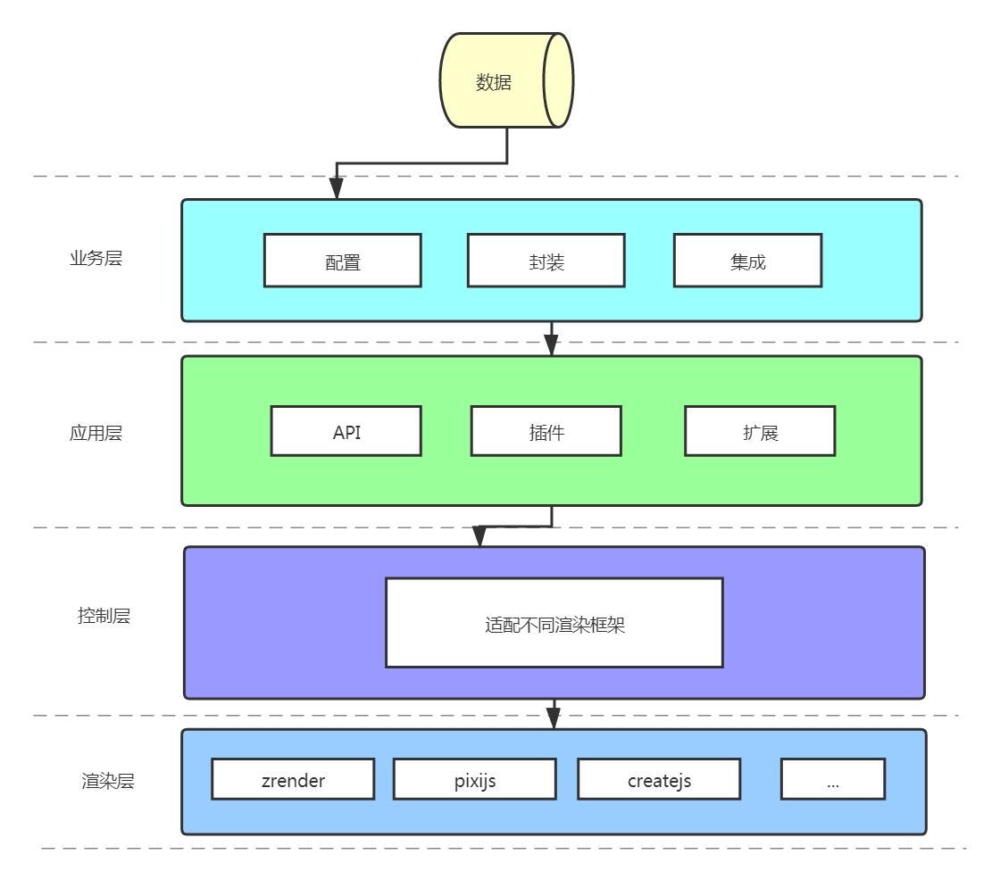
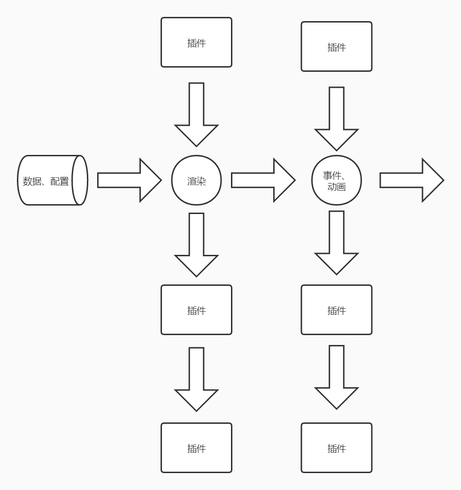

### DDChart是默认基于**pixijs**(https://www.pixijs.com/tutorials) 2D渲染引擎。

### 在DDChart内将渲染引擎称为驱动器(drive)，这个驱动器是可以替换的，比如可替换为createjs（与pixijs的api相似），因此要为DDChart做一些适配工作。由此将整个库分为以下几层：



### 从下往上：
+ 渲染层：即渲染引擎（驱动器），这一层不需要开发，只需在控制引用。
+ 控制层：也叫适配层，针对不同的驱动器做一些适配工作，直接提取驱动器所有方法挂载到全局对象，并完善驱动器所没有的基本功能，然后提供给应用层调用。（需要开发）
+ 应用层：提供一些常见实际应用，及其基本的操作，比如关联图谱。（需要开发）
+ 业务层：实际使用者，传入数据和参数配置，可以自己选择使用驱动器，自己去扩展应用层的功能，或者自定义方法。

### 应用层执行逻辑如图：


---

### 目录结构（只针对有修改的部分进行说明，其余配置为默认生成文件）
```
build                                 // 代码编译后生成的临时目录
public                                // 默认生成的目录
src                                   // 项目源码目录
    |-application                     // 应用层
    |-controller                      // 控制层
    |-index.js                        // 工具入口文件
    |-test.js                         // 业务层使用测试
.gitignore                            // git忽略提交配置文件
package.json                          // npm配置文件
webpack.config.xxx.js                 // webpack配置文件
README.md                             // 项目说明文档
```

*运行相关*

### 安装项目依赖包
```
npm install
```

### 运行项目
```
npm run start
```

### 项目打包
```
npm run build
```
